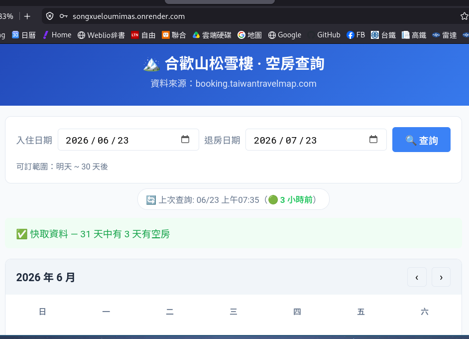
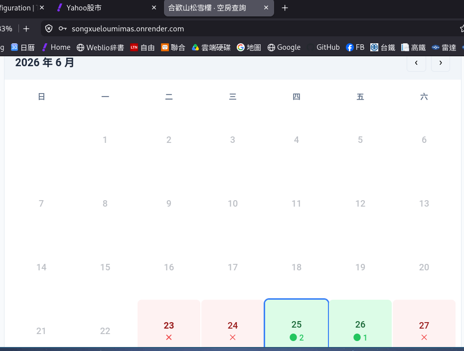
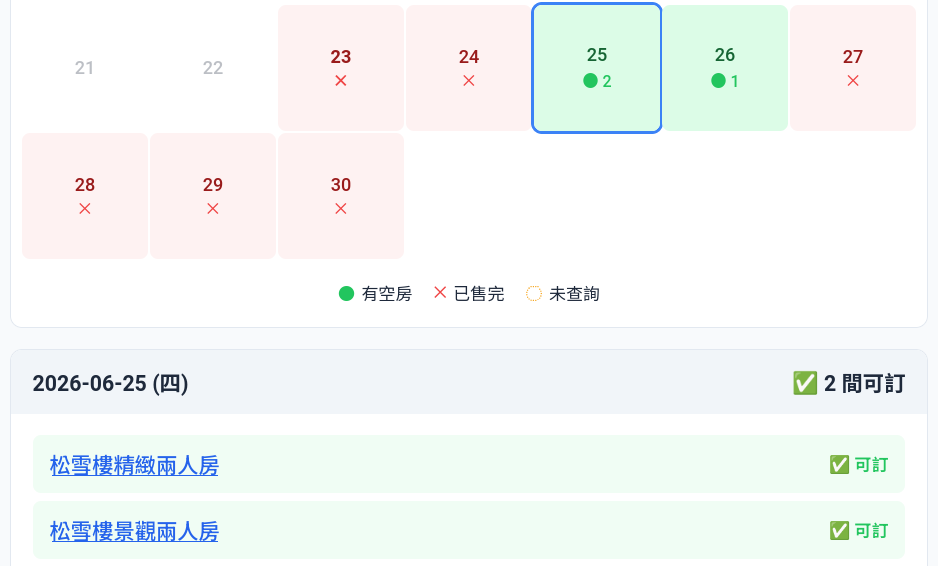
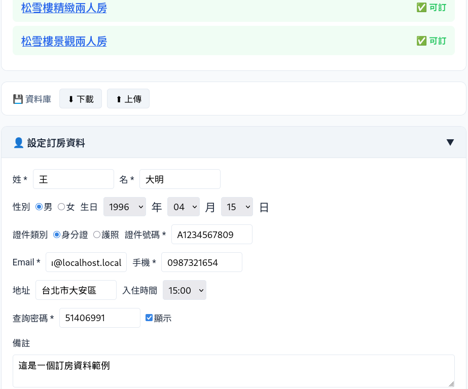
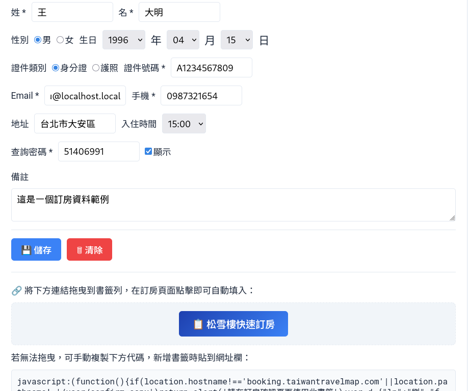
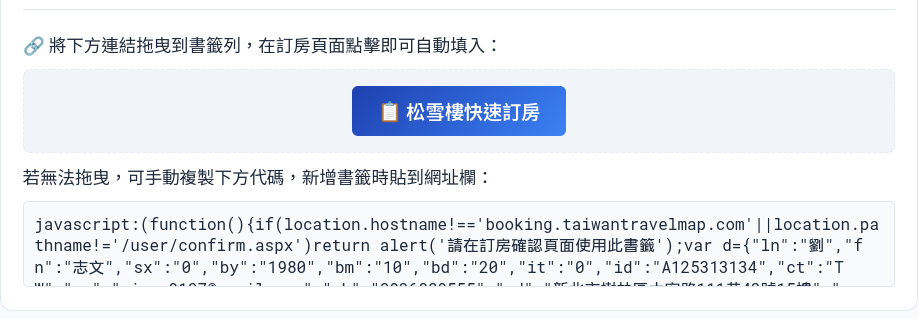
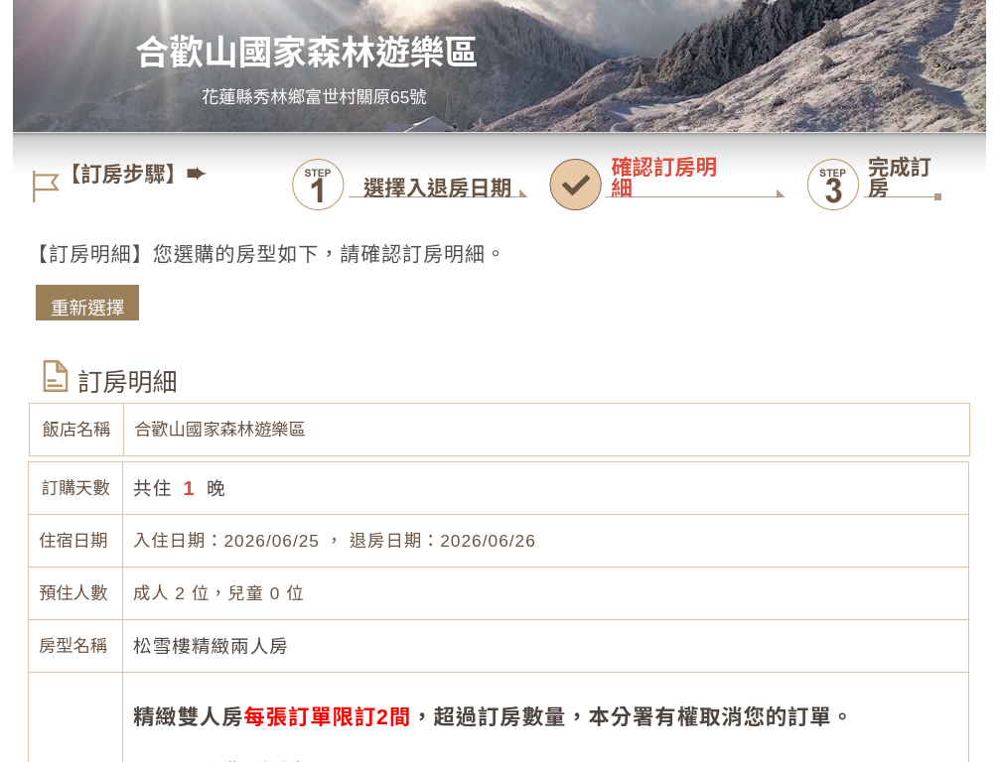
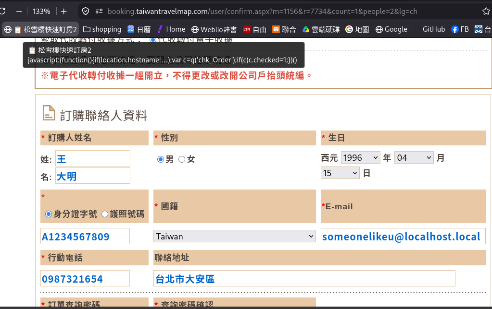

# 合歡山松雪樓空房查詢與快速訂房工具 - 圖文使用說明

歡迎使用 **合歡山松雪樓空房查詢與快速訂房工具**！
本工具幫助您快速掌握松雪樓的空房狀況，
並透過專屬的「書籤小工具 (Bookmarklet)」功能，
讓您在搶房時能一鍵自動帶入所有個人資料，提升訂房成功率。

以下是完整的使用步驟教學：

---

## 第一部分：查詢空房狀況

### 步驟 1：設定查詢範圍
進入系統首頁後，您可以設定欲查詢的「入住日期」與「退房日期」（系統預設查詢未來 30 天內的空房狀況）。
點擊「查詢」按鈕獲取最新資料。

### 步驟 2：檢視月曆與空房日期
系統會以月曆形式呈現每一天的房況。
- 顯示 **綠色點與數字**：代表當天有空房，數字為總剩餘間數。
- 顯示 **紅色 X**：代表當天已售完。

### 步驟 3：確認可訂房型
點擊有空房的日期後，下方會列出當天具體還有哪些房型可供預訂
（例如：松雪樓精緻兩人房、景觀兩人房等），讓您一目了然。

---

## 第二部分：設定「一鍵快速訂房」書籤

為了在官方網站上搶房時能節省輸入資料的時間，
您可以先在本工具中建立專屬的「快速訂房書籤」。

### 步驟 4：填寫預設訂房資料
向下滑動至「設定訂房資料」區塊，填寫您的訂房必填資訊（包含姓名、性別、生日、身分證字號、Email、手機、地址等）。
這些資料僅會儲存在您的瀏覽器中產生捷徑書籤，不會外洩。

### 步驟 5：儲存資料產生快速訂房書籤
填寫完畢後，點擊左下角的「儲存」按鈕。儲存成功後，下
方會出現一個藍色的「松雪樓快速訂房」按鈕。

### 步驟 6：將按鈕拖曳至書籤列
請將該藍色的「松雪樓快速訂房」按鈕，直接 **拖曳（Drag and Drop）** 到您瀏覽器的上方「書籤列 (Bookmarks Bar)」。
> **提示**：若您的瀏覽器未顯示書籤列，請先至瀏覽器設定中開啟「顯示書籤列」功能（快捷鍵通常為 `Ctrl+Shift+B` 或 `Cmd+Shift+B`）。

### 步驟 7：建立書籤完成
拖曳完成後，您的瀏覽器書籤列就會出現一個名為「松雪樓快速訂房」的書籤。
這就代表設定完成囉！

---

## 第三部分：實戰！在官方網站一鍵填表

### 步驟 8：前往官方訂房網站選房
當您發現有空房時，
點選搜尋出的空房連結，
前往官方的訂房頁面，
並正常選擇房型進入「訂房確認（填寫聯絡人資料）」的畫面。

### 步驟 9：點擊書籤，一鍵帶入資料
在官方填寫資料的頁面上，直接 **點擊您剛剛加到書籤列的「松雪樓快速訂房」**。
系統就會瞬間幫您把姓名、身分證、電話、地址等所有欄位自動填寫完畢！
您可以直接送出訂單，完成訂房！

## 注意! 書籤列的快速訂房書籤僅是快速填表單用途，本實作並不負擔個資的維護、存儲，其中個資請自行善加保管! 
## 如有疑慮請自行刪除當次任務的書籤，下此任務再重新產生亦可。 
---
祝您訂房順利！
